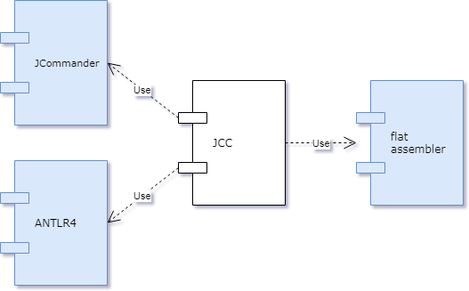

# Architecture

This document describes the architecture of JCC, the Johan Compiler Collection.

## Overview

JCC is a collection of compilers. In this document, the BASIC compiler is used as an example, 
but all compilers work the same way. The JCC production code is written in Java, with some of
the unit tests being written in Kotlin. The compiler front-end uses a library called
[JCommander](http://jcommander.org) to parse command line arguments, and another library called
[ANTLR4](http://www.antlr.org) to parse the source code being compiled. The compiler back-end 
uses [flat assembler](http://flatassembler.net) to turn the generated assembly code into an 
executable file.

To be continued...

<small>Diagrams created with the help of [draw.io](https://draw.io).</small>
