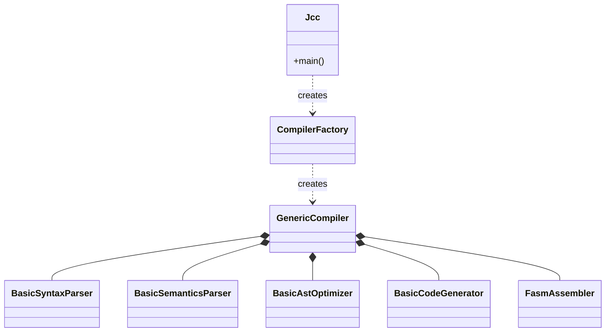
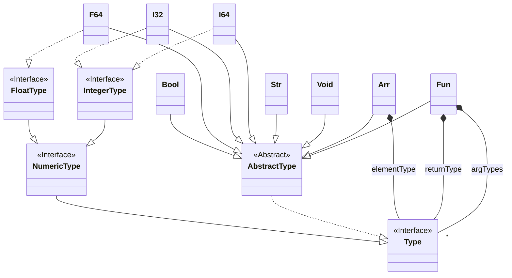
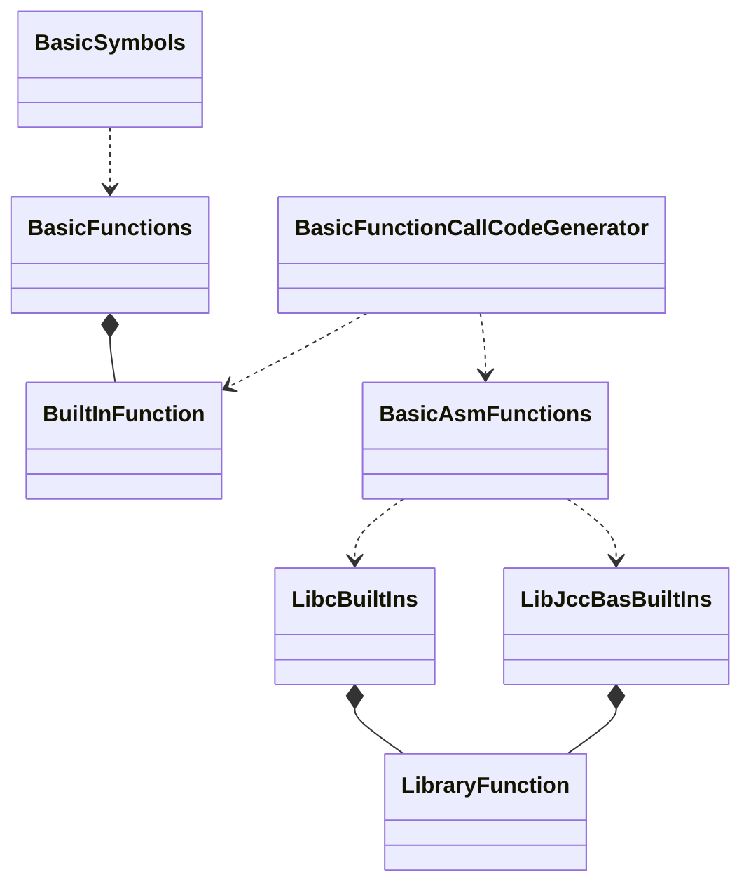

# Architecture

This document describes the architecture of JCC, the Johan Compiler Collection.


## Contents

<!-- TOC -->
* [Architecture](#architecture)
  * [Contents](#contents)
  * [Overview](#overview)
  * [Maven Modules](#maven-modules)
  * [Main Classes](#main-classes)
  * [Data Flow](#data-flow)
  * [Type System](#type-system)
  * [Intermediate Representation](#intermediate-representation)
  * [Built-In Functions](#built-in-functions)
  * [User-Defined Functions](#user-defined-functions)
  * [Garbage Collector](#garbage-collector)
<!-- TOC -->

## Overview

JCC is a collection of toy compilers. In this document, the BASIC compiler is used as an example, 
but all compilers work more or less the same way. The JCC production code is written in Java, 
while the unit tests are written in Kotlin. The compiler front-end uses 
[JCommander](http://jcommander.org) to parse command line arguments, and 
[ANTLR4](http://www.antlr.org) to parse the source code being compiled. The compiler back-end 
uses [flat assembler](http://flatassembler.net) to turn the generated assembly code into an 
executable file.


The compiler architecture permits other technologies to be used instead of ANTLR4 and flat assembler.
A future compiler may use a recursive decent parser to parse the code, and GCC to generate the 
executable file from a subset of C. Or it may use LLVM to generate the executable file from LLVM IR.


## Maven Modules


## Main Classes

The main class of JCC is called `Jcc`. It is responsible for parsing the command line arguments,
and for creating the `CompilerFactory`, that later is used to create the actual `Compiler` instance.
The single implementation of the `Compiler` interface is called `GenericCompiler`. This class is,
as the name implies, not tied to any language. It is little more than a collection of components
representing different parts of the compilation pipeline. The `CompilerFactory` creates the right 
components matching the language of the source code.

The chart below shows a simplified view of the relations between the main classes, using the BASIC
compiler as an example.




## Data Flow

TBD


## Type System

The internal type system of JCC has been designed to be independent of both the type system of
the implementation language (Java), and the source languages to compile. The goal is to make it
flexible enough to represent types in many languages.

The base of the type system is the interface `Type`. This interface is extended by `NumericType`
to represent all numeric types, with further specialization into `FloatType` and `IntegerType`. 
The numeric types that have been implemented so far are 64-bit integers and floats as well as 
32-bit integers. There are also boolean (`Bool`) and string (`Str`) types for languages that 
support them.

The class `Fun` represents a function type. Functions types are parameterized by their argument 
and return types.

The class `Arr` represents an array type. Arrays are parameterized by their element type, and their
dimension. Arrays are described in more detail [here](Arrays.md).




## Intermediate Representation

The current version of JCC does not employ any intermediate representation during code generation.
The code generator converts the AST directly to assembly code. To enable advanced optimization and
improve code quality, this will likely have to change in the future.

However, JCC does have experimental support for [using LLVM as backend](LLVM.md) instead of flat assembler.
Using LLVM requires using LLVM IR as intermediate representation.


## Built-In Functions

Built-in, or intrinsic, functions are represented by the class `BuiltInFunction`. All built-in
functions of a specific language are defined as constants in one class, for example `BasicFunctions`
for the BASIC language. They are added to the root symbol table of the language in yet another
class, for example `BasicSymbols`. These classes are used during semantic analysis.

During code generation, a built-in function definition is either mapped to an expression that
can be inlined, or to a library function that provides the implementation of the function. For
BASIC, the mapping is done by classes `BasicFunctionCallCodeGenerator` and `BasicAsmFunctions`.
In the future, there will also be a `BasicLlvmFunctions` to map functions during LLVM code 
generation.

The inlinable expressions are represented by normal expressions, for example `SqrtExpression`.
Library functions are represented by instances of the class `LibraryFunction`. These instances 
are defined in either `LibcBuiltIns` or a language specific class like `LibJccBasBuiltIns` 
depending on where they are implemented.




## User-Defined Functions

JCC supports user-defined expression functions. In BASIC, that means DEF FN expression functions,
for example:

```BASIC
DEF FNcube(x AS DOUBLE) = x * x * x
```

The types DOUBLE, INTEGER, and STRING can be used as arguments and return values. Arrays cannot 
be used as arguments or return values.

A user-defined function in JCC is represented in the symbol table by the class `UserDefinedFunction`,
and defined by class `FunctionDefinitionStatement`. The class `SymbolTable` now has the concept of 
a parent symbol table to support function arguments, and separate them from global variables.


## Garbage Collector

JCC provides a simple mark-and-sweep garbage collector for languages that need garbage collection
(currently only BASIC). The garbage collector is described in more detail [here](GarbageCollector.md).
