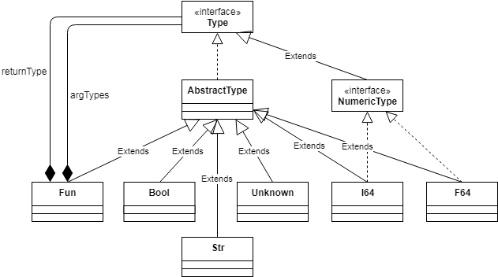

# Architecture

This document describes the architecture of JCC, the Johan Compiler Collection.

## Overview

JCC is a collection of compilers. In this document, the BASIC compiler is used as an example, 
but all compilers work the same way. The JCC production code is written in Java, with some of
the unit tests being written in Kotlin. The compiler front-end uses a library called
[JCommander](http://jcommander.org) to parse command line arguments, and another library called
[ANTLR4](http://www.antlr.org) to parse the source code being compiled. The compiler back-end 
uses [flat assembler](http://flatassembler.net) to turn the generated assembly code into an 
executable file.

## Main Classes

TBD

## Data Flow

TBD

## Type System

The internal type system of JCC has been designed to be independent of both the type system of
the implementation language (Java) and the source languages to compile. Hopefully, it will prove
flexible enough to represent types in many different languages.

The base of the type system is the interface `Type`. This interface is extended by `NumericType`
to represent all numeric types. The numeric types that have been implemented so far are 64-bit
integers and floats. The class `Unknown` is used in situations where the actual type is not
known, for example when parsing the left hand side of an assignment in BASIC.

The class `Fun` represents a function type. Functions types are parameterized by their argument
and return types.

## Garbage Collector

JCC provides a simple mark-and-sweep garbage collector for languages that need garbage collection
(currently BASIC). The garbage collector is described in more detail [here](GarbageCollector.md).

<small>Diagrams created with the help of [draw.io](https://draw.io).</small>
