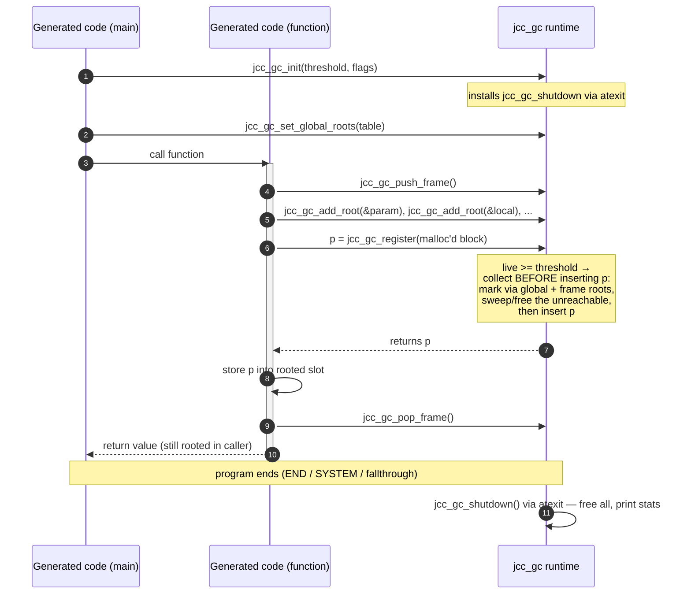

# Garbage Collection (LLVM Backend)

JCC's LLVM backend manages dynamic memory automatically with a garbage collector.
This document describes the collector from the point of view of someone reading
the generated code or writing a client of the runtime — the model it is built on,
how the generated program talks to it, the API it exposes, and how to observe it
at runtime. The collector's internals (the mark-and-sweep implementation itself)
live in the `libjccbas` runtime library and are only sketched here.

> **Status:** this is the target design for the LLVM backend, tracked in GitHub
> issue #63 and implemented in independently shippable phases. The architecture
> decision is recorded in [ADR 0003](adr/0003-llvm-gc-shadow-stack.md). See
> [Status](#status) below for what that means for the code today.


## Contents

* [Overview](#overview)
* [Concepts](#concepts)
* [Runtime interaction](#runtime-interaction)
* [A worked example: BASIC to LLVM IR](#a-worked-example-basic-to-llvm-ir)
* [The GC API](#the-gc-api)
* [Debug output and command-line options](#debug-output-and-command-line-options)
* [Status](#status)
* [Appendix: `jcc_gc.h`](#appendix-jcc_gch)


## Overview

Some values in a program need memory that outlives the expression that produced
it and whose lifetime the compiler cannot determine statically. In the languages
JCC compiles, the clearest example is a **string**: `A$ = LCASE$(B$) + C$`
allocates a fresh block on the heap, and there is no syntactic point at which the
program can be sure that block is no longer referenced.

The garbage collector reclaims that memory. It is a **precise mark-and-sweep**
collector: periodically it walks every reachable value (*mark*) and frees
everything else (*sweep*). It runs automatically — the compiler emits the calls
that drive it as part of ordinary code generation, and no source-language
construct is needed to trigger or control it. Today the only garbage-collected
type is the string; the design is deliberately extensible to future heap types
such as closures and records (see [Concepts](#concepts)).

The collector is a plain C library (`jcc_gc_*`). The compiler
drives it by emitting **ordinary LLVM IR calls** into the generated program — no
LLVM GC intrinsics, no code-generator plugin, no special compilation pipeline.
That keeps the mechanism working at every optimization level with a stock
`clang`, and keeps the whole design in code the compiler controls. It is
language-agnostic, and both languages with a heap type use it: BASIC for its
strings, and COL for its own — the string is COL's only heap type.

The C source is canonical in `libjccbas` and vendored into `libjcccol` as an
identical copy, so a COL program links the same collector without depending on the
BASIC runtime. The vendored copy keeps its upstream `jcc_gc_*` names rather than
taking libjcccol's `col_` prefix, so the same symbols appear whichever library a
program links. See [Status](#status) for what adopting it in COL required.


## Concepts

### Precise, and the stack is never scanned

The collector is *precise*: it knows exactly which memory locations hold pointers
to collectable objects, because the compiler tells it. It never inspects the
native machine stack or CPU registers looking for pointer-like values. This is
what makes it portable — there is no platform-specific stack-walking code — and
what makes it exact, with no risk of a stray integer that happens to look like a
pointer keeping garbage alive.

### Roots are slot addresses

A **root** is a place the program can reach a pointer from: a global variable, a
local variable, or a temporary. The collector does not track *pointers* as roots;
it tracks the **address of the slot** that holds a pointer.

You register the address of a slot once. Thereafter the collector reads the
slot's *current* contents every time it marks. Three consequences follow:

* **Reassigning a variable needs no GC call** — you just store the new pointer
  into the already-registered slot, and the next mark sees it.
* **A slot may legally hold anything pointer-shaped**: `NULL`, a pointer into
  read-only data (a string literal), or a pointer to a collector-owned block.
  At mark time the collector looks the value up in its table of owned blocks and
  simply ignores values it does not own. This is why a function may safely return
  its own argument, or a string literal, without any special case.
* The collector needs no per-variable type bookkeeping — a registered slot is
  just a `void **`.

### Global roots: one table

A program's global string variables (and the element regions of global string
arrays) are known only after the whole program body has been generated. Rather
than emit one registration call per global, the compiler emits a **single
null-terminated table** of ranges and registers it once, in `main`. Each entry is
a `{slots, count}` range:

* a scalar global is a range of **count 1**;
* a string array's contiguous `[N x ptr]` element region is **one range of
  count N**.

One construct covers both the single-slot and the many-slots cases.

### Local roots and shadow-stack frames

Local variables and temporaries are rooted per function call, using a **shadow
stack** of frames — a structure the runtime maintains itself, distinct from the
native call stack:

* Every function (and `main`) calls `jcc_gc_push_frame` in its prologue and
  `jcc_gc_pop_frame` before it returns. A frame is just a watermark: push records
  the current root-stack depth, pop truncates back to it, dropping every root
  added in between.
* String **parameters** are rooted in the *callee's* frame (the callee stores the
  incoming pointer into its parameter slot and registers that slot's address).
* String **locals** and compiler-generated **temporary slots** are rooted after
  they are allocated, initialized to `NULL` first so the slot is always safe to
  read.

Because a temporary lives in a fixed synthetic slot that is overwritten on reuse,
a loop retains at most one dead value per static slot — bounded, with no runtime
temp-tracking arrays and no statement-boundary analysis.

### Registration transfers ownership

Runtime functions such as string concatenation keep allocating with `malloc` and
know nothing about the GC. Ownership is handed over at a single point:
`jcc_gc_register(p)` takes the pointer *value* `p`, hands ownership of that block
to the collector, and returns `p` so the call chains directly onto the producing
call.

Two properties matter to a reader of the generated code:

* **Collect-before-insert.** A registration may trigger a collection, and that
  collection runs *before* `p` is entered into the owned-block table — so a
  registration can never free the very block it is registering.
* **Register-then-store contract.** After `jcc_gc_register(p)` returns, the
  compiler stores `p` into a registered root slot before the next registration.
  This is what keeps a freshly produced value reachable across the collection
  that the *next* allocation might trigger.

The collector reclaims an unreachable block with `free` (or, for a type that
declares one, a finalizer).

### Triggering

Collection is driven by a **live-object threshold**. Registration counts live
objects; when the count reaches the threshold a collection runs, and afterwards
the threshold grows (it doubles while the surviving population still exceeds half
of it) so that steady-state programs collect less often as they grow. The initial
threshold comes from the compiler flag `-initial-gc-threshold` (see
[Debug output and command-line options](#debug-output-and-command-line-options)).

### Extensibility beyond strings

Every owned block carries a pointer to a **type descriptor**. A string passes a
`NULL` descriptor: it is a *leaf* object (no interior pointers) reclaimed with a
plain `free`. A future heap type with interior references — a closure capturing
strings, a record with string fields — provides a descriptor whose `trace`
callback marks those interior references, and optionally a `finalize` callback
that runs instead of `free`. The descriptor type is part of the API today
(`jcc_gc_type_t`); only the string (leaf) case is emitted so far.

> The mark-and-sweep implementation — the owned-block table, the root stack, the
> mark and sweep loops — lives in `libjccbas` and is intentionally out of scope
> here. This document specifies only the contract the compiler and any other
> client rely on.


## Runtime interaction

The sequence below shows the calls a generated program makes into the `jcc_gc`
runtime over its lifetime: `main` initializes the collector and registers the
global root table; a called function opens a frame, roots its locals, registers
the values it produces (one of which triggers a collection here), stores each
into its slot, and closes the frame before returning; and the exit-time shutdown
runs via `atexit`.



The ordering is the point: roots are established *before* any allocation can run
a collection, registration collects *before* inserting the new block, and a
returned value stays reachable because it is rooted in the caller before the
callee's frame is popped.


## A worked example: BASIC to LLVM IR

Consider a BASIC program with a global string variable and a user-defined
function that returns its own argument:

```basic
DEF FNecho$(x$) = x$
s$ = FNecho$(LCASE$("HELLO") + "!")
PRINT s$
```

The interesting IR (simplified, with the GC calls highlighted) looks like this.

In `main`, the collector is initialized and the global root table — here just the
one scalar `@s$` — is registered before any string work happens:

```llvm
; global string variable s$ and the root table describing it
@s$ = private global ptr null
@jcc.gc.global.roots = private global [2 x { ptr, i64 }]
    [{ ptr @s$, i64 1 }, { ptr null, i64 0 }]     ; count-1 range, then terminator

define i32 @main() {
entry:
  call void @jcc_gc_init(i64 100, i64 0)          ; threshold, flags
  call void @jcc_gc_set_global_roots(ptr @jcc.gc.global.roots)
  call void @jcc_gc_push_frame()
  ; ... generate the assignment ...
```

The right-hand side `LCASE$("HELLO") + "!"` produces two heap blocks (the
lower-cased copy, then the concatenation). Each producing call is immediately
wrapped in `jcc_gc_register`, and the result is stored into a synthetic slot
`%.gc.slot.N` that was rooted in the prologue — so the second registration, which
may collect, cannot free the first result:

```llvm
  %1 = call ptr @"lcase$"(ptr @.str.hello)
  %2 = call ptr @jcc_gc_register(ptr %1)          ; owns the lcase result
  store ptr %2, ptr %.gc.slot.0                   ; kept reachable across the next register

  %3 = call ptr @add_Str_Str(ptr %2, ptr @.str.bang)
  %4 = call ptr @jcc_gc_register(ptr %3)          ; owns the concatenation
  store ptr %4, ptr %.gc.slot.1
```

The concatenation is then passed to `FNecho$`. Nothing is freed after the call —
the argument stays rooted in the caller's slot `%.gc.slot.1` for the whole
statement, *and* in the callee's own parameter slot — so `FNecho$` returning that
very pointer is safe. The user function's result was already registered inside the
callee, so the caller only needs to root it:

```llvm
  %5 = call tailcc ptr @"fnecho$"(ptr %4)
  store ptr %5, ptr %.gc.slot.2                   ; protect the returned value
  store ptr %5, ptr @s$                           ; plain assignment — no GC call
  ; ... PRINT s$ ...
  call void @jcc_gc_pop_frame()
  ret i32 0
}
```

The callee roots its parameter in *its own* frame and pops before returning; there
is no allocation between the pop and the caller's store, so the returned pointer
survives:

```llvm
define tailcc ptr @"fnecho$"(ptr %0) {
entry:
  call void @jcc_gc_push_frame()
  %x$ = alloca ptr
  store ptr %0, ptr %x$
  call void @jcc_gc_add_root(ptr %x$)             ; parameter rooted in the callee
  ; ... body ...
  %r = load ptr, ptr %x$
  call void @jcc_gc_pop_frame()
  ret ptr %r                                      ; safe: no allocation after pop
}
```

Two things this example demonstrates by construction: a value is never freed while
it is still reachable from a rooted slot, and a function that returns its argument
(or a string literal) needs no special handling, because roots are slot addresses
whose contents are simply looked up — and unowned values are ignored — at mark
time.


## The GC API

This is the interface a client — the compiler, or any other consumer of the
runtime — programs against. Every function is prefixed `jcc_gc_`. The library is
**single-threaded** and **not async-signal-safe**. The complete C header is
reproduced in the [appendix](#appendix-jcc_gch).

### Initialization

* **`void jcc_gc_init(int64_t initial_threshold, int64_t flags)`** — called once,
  first thing in `main`, before any other `jcc_gc_*` call. An
  `initial_threshold <= 0` selects the default (100). Installs `jcc_gc_shutdown`
  via `atexit`. `flags` currently carries only `JCC_GC_DEBUG` (see
  [Debug output](#debug-output-and-command-line-options)).

### Global roots

* **`void jcc_gc_set_global_roots(const jcc_gc_root_range_t *ranges)`** — called
  once from `main` after `jcc_gc_init`. `ranges` points to an array of
  `{ void **slots; int64_t count; }` terminated by `{NULL, 0}`. The array is
  *read at every collection, not copied*, so it must stay valid for the whole
  program (the compiler emits it as a global). A scalar is `{&slot, 1}`; a string
  array's element region is `{base, N}`.

### Frames and local roots

* **`void jcc_gc_push_frame(void)`** — opens a frame on function entry. Cheap: it
  records a watermark.
* **`void jcc_gc_pop_frame(void)`** — closes the current frame, dropping every
  root added since the matching push. Called before `ret`, and before a
  guaranteed tail call.
* **`void jcc_gc_add_root(void **slot)`** — adds a pointer slot (the address of an
  `alloca` or global) to the current frame. The slot must hold `NULL` or a valid
  pointer whenever a collection may run, so non-parameter slots are initialized to
  `NULL` before being rooted.

### Registration

* **`void *jcc_gc_register(void *p)`** — transfers ownership of the `malloc`'d
  block `p` to the collector and returns `p`. May run a collection *before*
  inserting `p`, so `p` is never reclaimed by the collection it triggers.
  Contract: store `p` into a registered root slot before the next
  allocation/registration. `p` must not already be registered; `NULL` is returned
  unchanged.
* **`void *jcc_gc_register_object(void *p, const jcc_gc_type_t *type)`** — as
  `jcc_gc_register`, but for objects with interior pointers. `type == NULL` is
  exactly `jcc_gc_register` (a leaf object). The descriptor
  `{ const char *name; void (*trace)(void *, jcc_gc_mark_fn); void (*finalize)(void *); }`
  lets a future closure/record type mark its interior references and run a custom
  finalizer.

### Collection, stats, shutdown

* **`void jcc_gc_collect(void)`** — runs a full mark-sweep collection immediately.
* **`void jcc_gc_stats(jcc_gc_stats_t *out)`** — fills in cumulative counters:
  registrations, currently-live objects, collections run, objects freed, and the
  current threshold.
* **`void jcc_gc_shutdown(void)`** — frees all remaining objects and, when debug
  is enabled, prints the exit-stats line. Installed via `atexit` by
  `jcc_gc_init`, so it still runs when `END`/`SYSTEM` call `exit()`. Safe to call
  more than once.

### Contract summary

* `jcc_gc_init` first, before any other call.
* Register, then store into a rooted slot before the next registration.
* A rooted slot always holds `NULL` or a valid pointer when a collection may run.
* Single-threaded; not async-signal-safe.


## Debug output and command-line options

Two compiler flags feed the collector (both are reused from the existing GC
options; they apply to the LLVM backend here):

| Flag | Effect |
|------|--------|
| `-initial-gc-threshold <n>` | Initial live-object threshold passed to `jcc_gc_init` (default 100). |
| `-print-gc` | Compiles in the `JCC_GC_DEBUG` flag, so the program emits GC debug output at runtime. |

At **runtime**, debug output is produced if the program was compiled with
`-print-gc` *or* the `JCC_GC_DEBUG` environment variable is set to a non-empty
value. Output goes to standard output, unless `JCC_GC_LOG=<path>` is set, in which
case lines are appended to that file. The events reported are initialization, each
collection (live count before → after, and threshold changes), and an exit-stats
line printed by `jcc_gc_shutdown`:

```
jcc_gc: exit: registered=N collections=M freed=K live=L
```

That exit line is the stable, documented output that integration tests assert on.

`live` on that line is bounded by the collection threshold, not by what the program still reaches:
a collection runs only when the live count reaches the threshold, so up to that many unreachable
objects can still be pending when the program ends. `freed` and `live` sum to `registered`. A test
proving reclamation should therefore compare `freed` against `registered` and bound `live` by the
threshold, not by a small constant — with `-initial-gc-threshold 100`, a loop that keeps exactly one
string reachable exits at `live=73` (`ColLlvmGarbageCollectionIT`).


## Debugging with AddressSanitizer

The functional integration tests catch a swept-too-early bug as wrong output or a
crash, but they cannot see a use-after-free or double-free that happens to leave
the visible output intact. AddressSanitizer (ASan) can. ASan is deliberately *not*
wired into the Maven build or exposed as a `jcc` flag — `libjccbas` is not built
with instrumentation — but ASan's `malloc`/`free` interceptors are installed by
linking its runtime into the final executable, so they still catch misuse of the
heap blocks that `libjccbas` allocates and the collector frees. The check is a
manual, on-demand procedure on a saved `.ll` file.

1. **Emit the LLVM IR.** Compile the program with the LLVM backend and `-save-temps`
   so the intermediate `<program>.ll` is kept (add `-print-gc` to watch the
   collector while debugging):

   ```
   java -jar jcc-compiler/target/jcc-compiler-*.jar \
       --backend LLVM --library-path jcc-compiler/target \
       -save-temps -print-gc -initial-gc-threshold 4 \
       -o program program.bas
   ```

2. **Recompile the IR under ASan**, linking the real runtime. This is the step
   `jcc` cannot do for you — it is a plain `clang` invocation with
   `-fsanitize=address`:

   ```
   clang -fsanitize=address program.ll \
       -L jcc-compiler/target -ljccbas -o program.asan
   ```

   On Linux add `-lm`. A benign `-Woverride-module` warning about the target triple
   is expected (clang re-derives the triple for the host).

3. **Run it.** A clean run prints the program's own output (and, under `-print-gc`,
   the usual `jcc_gc:` lines) and exits `0` with **no** `==ERROR: AddressSanitizer`
   report:

   ```
   n29 global
   jcc_gc: exit: registered=91 collections=22 freed=84 live=7
   ```

   Any `heap-use-after-free`, `heap-double-free`, or `heap-buffer-overflow` report
   is a real GC bug — most likely a root that was dropped too early or a block that
   was registered but not actually owned by the program.

Note on leaks: this procedure targets heap *misuse*, not leak accounting. On Linux,
where LeakSanitizer runs by default, the strings still live at exit are freed by the
`atexit` `jcc_gc_shutdown`, so no leaks should be reported; if you truncate a run
before shutdown, suppress the leak pass with `ASAN_OPTIONS=detect_leaks=0` to keep
the focus on use-after-free and double-free.


## Status

The collector is the memory-management model for the LLVM backend, delivered across the
phases of GitHub issue #63. This document and [ADR 0003](adr/0003-llvm-gc-shadow-stack.md)
are the architecture decision and API specification; the compiler plumbing and the
`libjccbas` runtime were built against that fixed contract.

Everything is in place. The LLVM backend registers every dynamic string — scalars, string
array elements, concatenation results, and library results — with the collector, emits the
shadow-stack frames and roots, and links against the real runtime (see
`docs/system/code-generation.md`, "Dynamic string memory (LLVM)" and "Garbage collector
plumbing (LLVM)"). Guaranteed tail calls pop their frame before the `musttail` call, and every
tail leaf now pops exactly once — including the *non*-`become` leaf of a tail if-expression,
which COL's own function-definition generator used to return from without popping (see
`working-notes/become-strings-and-gc.md`; BASIC was never affected, having no `become`). The
`jcc_gc.h` header below is the API of record in this repository; the canonical copy lives in the
`libjccbas` runtime (2.2.0).

COL is now the second language on the collector, as its strings are heap-allocated. It vendors
`jcc_gc.[ch]` in `libjcccol` 0.2.0 and declares its string functions in `LibJccColBuiltIns`. This
needed no jcc-llvm changes at all, which is requirement 7 holding up: a language opts in purely by
wiring `RuntimeGcCodeGenerator` — plus threading it into any shared component its own generators
construct themselves.


## Appendix: `jcc_gc.h`

The complete C header — the API specification for the collector.

```c
/*
 * jcc_gc.h - JCC runtime garbage collector.
 *
 * Precise mark-sweep collector with compiler-managed roots (shadow stack).
 * The compiler registers the ADDRESSES of pointer slots (globals, allocas);
 * the collector reads each slot's current value at mark time. Slot values
 * that are NULL or do not refer to a registered allocation (e.g. string
 * literals) are ignored, so a slot may legally hold any of these.
 *
 * Ownership: jcc_gc_register(p) transfers ownership of a malloc'd block p
 * to the GC; unreachable blocks are reclaimed with free() (or the type's
 * finalize callback). Runtime string functions keep allocating with malloc
 * and are unaware of the GC.
 *
 * Canonical copy: libjccbas. libjcccol vendors an identical copy.
 * Single-threaded. Not async-signal-safe.
 */
#ifndef JCC_GC_H_
#define JCC_GC_H_

#include <stdint.h>

/* ---- Type descriptors (future closures/records; strings use NULL) ---- */

/* Mark callback handed to trace functions: marks one referenced object. */
typedef void (*jcc_gc_mark_fn)(void *obj);

typedef struct jcc_gc_type {
    const char *name;                              /* for debug output        */
    void (*trace)(void *obj, jcc_gc_mark_fn mark); /* mark interior refs;
                                                      NULL = leaf object      */
    void (*finalize)(void *obj);                   /* NULL = plain free(obj)  */
} jcc_gc_type_t;

/* ---- Initialization ---- */

/* Flags for jcc_gc_init. */
#define JCC_GC_DEBUG ((int64_t) 1)  /* enable debug output */

/*
 * Initialize the collector. Called once, first in main, before any other
 * jcc_gc_* call. initial_threshold <= 0 selects the default (100).
 * Installs jcc_gc_shutdown with atexit(). Debug output is enabled by the
 * JCC_GC_DEBUG flag or by a non-empty JCC_GC_DEBUG environment variable;
 * it is written to stdout, or appended to the file named by the
 * JCC_GC_LOG environment variable when set.
 */
void jcc_gc_init(int64_t initial_threshold, int64_t flags);

/* ---- Global roots ---- */

/*
 * A range of consecutive pointer slots: a scalar global is {&slot, 1},
 * a string array's element region is {base, element_count}.
 */
typedef struct jcc_gc_root_range {
    void   **slots;
    int64_t  count;
} jcc_gc_root_range_t;

/*
 * Register the program's global roots: 'ranges' points to an array of
 * ranges terminated by {NULL, 0}. The array is read at every collection
 * (not copied), so it must stay valid for the program's lifetime.
 * Called once from main, after jcc_gc_init.
 */
void jcc_gc_set_global_roots(const jcc_gc_root_range_t *ranges);

/* ---- Shadow-stack frames and local roots ---- */

/* Open a frame on function entry. Cheap: records a watermark. */
void jcc_gc_push_frame(void);

/* Close the current frame, dropping all roots added since push_frame.
 * Called before ret, and before a musttail call. */
void jcc_gc_pop_frame(void);

/*
 * Add a pointer slot (the address of an alloca or global) to the current
 * frame. The slot must contain NULL or a valid pointer whenever a
 * collection may run, so initialize non-parameter slots with NULL first.
 */
void jcc_gc_add_root(void **slot);

/* ---- Allocation registration ---- */

/*
 * Transfer ownership of malloc'd block p to the GC and return p.
 * May run a collection BEFORE p is inserted, so p is never reclaimed by
 * the collection it triggers itself. CONTRACT: the caller must store p
 * into a registered root slot before the next allocation/registration.
 * p must not already be registered. NULL is returned unchanged.
 */
void *jcc_gc_register(void *p);

/*
 * As jcc_gc_register, for objects with interior pointers (future:
 * closures, records). type == NULL is equivalent to jcc_gc_register.
 */
void *jcc_gc_register_object(void *p, const jcc_gc_type_t *type);

/* ---- Collection, stats, shutdown ---- */

/* Run a full mark-sweep collection now. */
void jcc_gc_collect(void);

typedef struct jcc_gc_stats {
    int64_t registered;   /* registrations since init            */
    int64_t live;         /* currently live objects              */
    int64_t collections;  /* collections run                     */
    int64_t freed;        /* objects reclaimed                   */
    int64_t threshold;    /* current collection threshold        */
} jcc_gc_stats_t;

void jcc_gc_stats(jcc_gc_stats_t *out);

/*
 * Free all remaining objects and print exit stats when debug is enabled:
 *   jcc_gc: exit: registered=N collections=M freed=K live=L
 * Installed via atexit by jcc_gc_init; safe to call multiple times.
 */
void jcc_gc_shutdown(void);

#endif /* JCC_GC_H_ */
```
