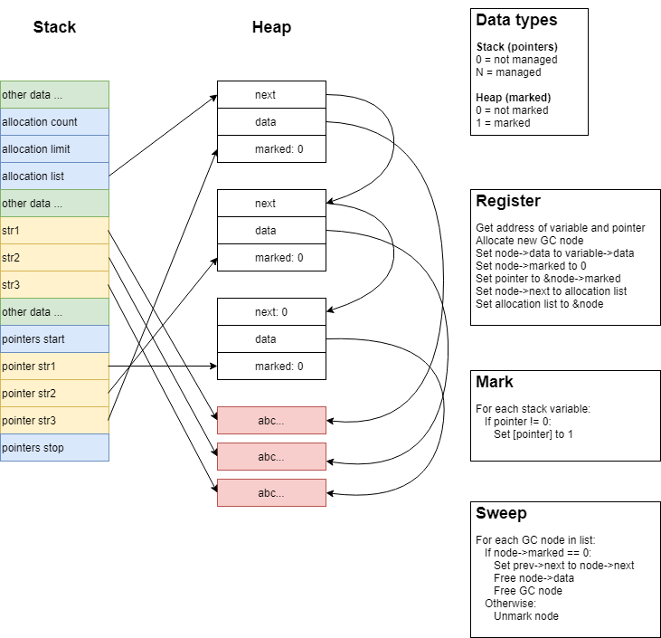

# Garbage Collector

## Contents

*   [Overview](#overview)
*   [Main Classes](#main-classes)
*   [Library Functions](#library-functions)

## Overview

TBD

## Main Classes

TBD

## Library Functions

* memory_register
* memory_mark
* memory_sweep
